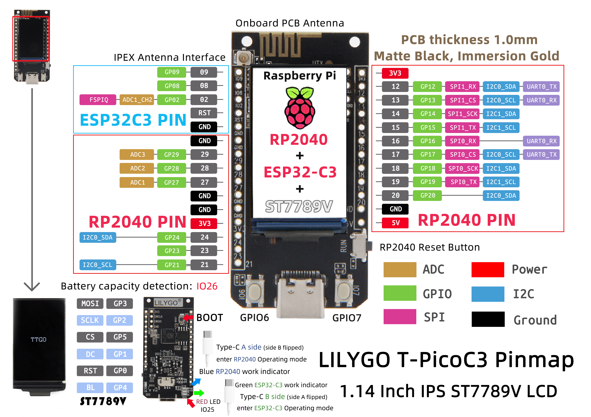
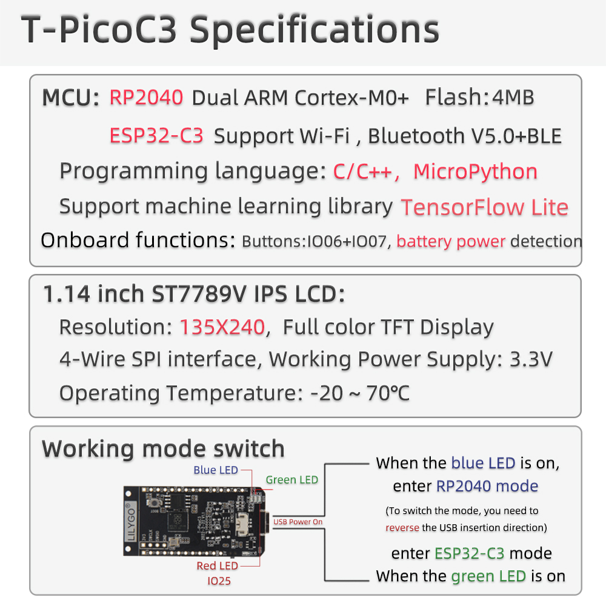
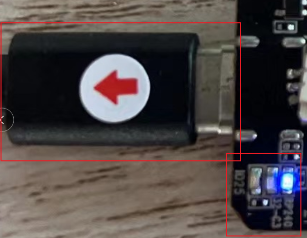
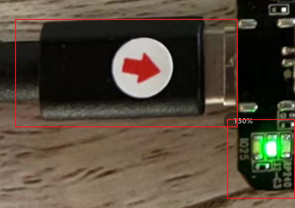
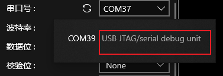

<h1 align = "center"> 🌟LilyGO T-PicoC3🌟</h1>





# Quick start:

## Notice 
### In TYPE-C, you can determine whether the current connection is PICO or ESP32C3 through positive and negative access. 


### When connecting, the onboard LED lamp will be indicated according to the connected chip (due to cable problems, it is possible that the indicator light is opposite to the actual connected chip, or even two LED lights at the same time, please replace another cable when two led lights up at the same time), the main judgment is that the currently connected device is displayed in the serial port name.




## RP2040 :
### Arduino

>1. Open up the Arduino IDE and go to File->Preferences.
>2. [Unofficial libraries](https://github.com/earlephilhower/arduino-pico) are used in the Arduino examples.In the dialog that pops up, enter the following URL in the "Additional Boards Manager URLs" field:
```
https://github.com/earlephilhower/arduino-pico/releases/download/global/package_rp2040_index.json
```
> 3. Go to Tools->Boards->Board Manager in the IDE
> 4. Type "pico" in the search box and select "Add":
> 5. Copy  **TFT_eSPI**  to the  **<C:\Users\Your User Name\Documents\Arduino\libraries>**  directory
> 6. Open **Arduino IDE,** find **TFT_eSPI** in the file and example, the **T-Display** factory test program is located at **TFT_eSPI -> FactoryTest**, you can also use other sample programs provided by TFT_eSPI
> 7. In the **Arduino IDE** tool options, select the development board  **Raspberry Pi Pico**, Other keep the default
> 8. Hold down the BOOT button, click the reset button, and release the BOOT button after a delay of one second or after waiting for the computer to eject a new disk
> 9. Finally, click upload or drag the firmware to the new disk
---
### MicroPython
>1. install [Thonny Python IDE](https://github.com/thonny/thonny/releases/download/v3.3.5/thonny-3.3.5.exe)
>2. After the installation is complete, you need to click on the toolbar, click Run -> Select Interpreter, enter the following interface, select **Raspberry Pi Pico**, you need to configure Pico before configuring the following ports
>3. Press the **BOOT** button, click **RES**, then go back to Thonny Python IDE and change the port to the serial port where Pico is located. If you don't find it, click **Install or update firmware**.
>4. Enter or save as a script to run
```
from machine import Pin, Timer
led = Pin(25,Pin.OUT)
tim = Timer()
def tick(timer):
    global led
    led.toggle()
tim.init(freq=2.5, mode=Timer.PERIODIC, callback=tick)
```
>5. If you need to save to the chip, you need to click **File->Save As->rp2040**.

>6. For more usage methods, please refer to the Micro python [documentation](http://docs.micropython.org/).

---
## ESP32-C3
### Arduino 
>1. Open up the Arduino IDE and go to File->Preferences.
>2. In the dialog that pops up, enter the following URL in the "Additional Boards Manager URLs" field:
* Stable release link:
```
https://raw.githubusercontent.com/espressif/arduino-esp32/gh-pages/package_esp32_index.json
```
* Development release link:
```
https://raw.githubusercontent.com/espressif/arduino-esp32/gh-pages/package_esp32_dev_index.json
```
> 3. Go to Tools->Boards->Board Manager in the IDE
> 4. Type "EPS32C3 Dev" in the search box and select "Add":
> 5. Click any "file-> example-> all esp32 esamle" and upload the run

#### ESP32-C3 Upload method
* ESP32C3 mainly uses ESP32-AT firmware here. If you want to use it as a coprocessor, you can modify the firmware.
* `Method 1`: if the serial port is displayed with the word jatg when connecting to USB, you can upload it directly using USB. (please note that do not use USB pins to define other functions, otherwise it will be troublesome to upload next time). 
* `Method 2`: (if there is no serial port when connecting ESP32C3 USB) disconnect USB, short connect ESP32C3-IO9 and GND, and then reconnect USB (note that ESP32C3 device is selected to connect USB).


| Product    |  Product Link  |
| :--------: | :------------: |
| T-PicoC3   | [Amazon(USA)](https://www.amazon.com/dp/B0B3RF87VG?ref=myi_title_dp)  |

| Pins       | RP2040          |
| ---------- | --------------- |
| TFT Driver | ST7789(240*135) |
| TFT_MISO   | N/A             |
| TFT_MOSI   | 3               |
| TFT_SCLK   | 2               |
| TFT_CS     | 5               |
| TFT_DC     | 1               |
| TFT_RST    | 0               |
| TFT_BL     | 4               |
| PWR_ON     | 22              |
| BOTTON1    | 6               |
| BOTTON2    | 7               |
| RedLED     | 25              |
